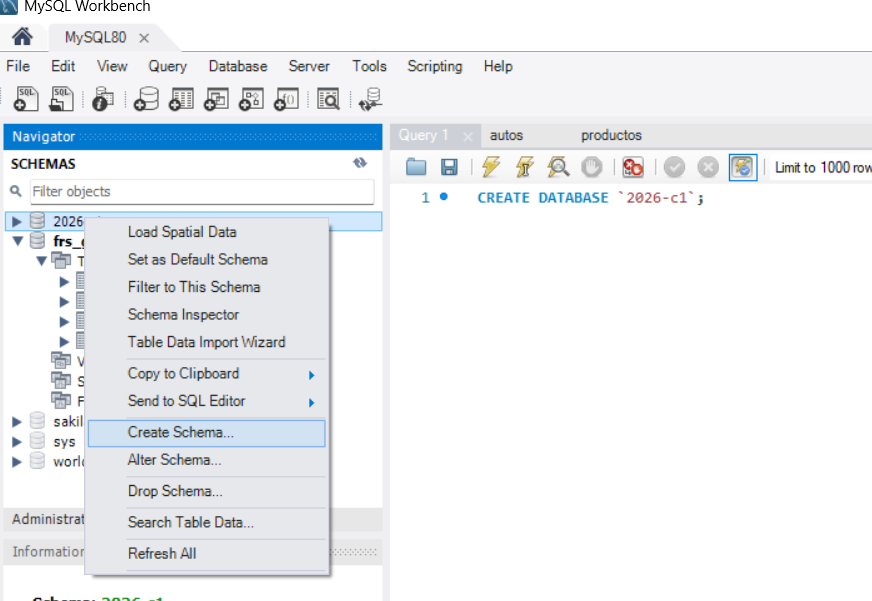
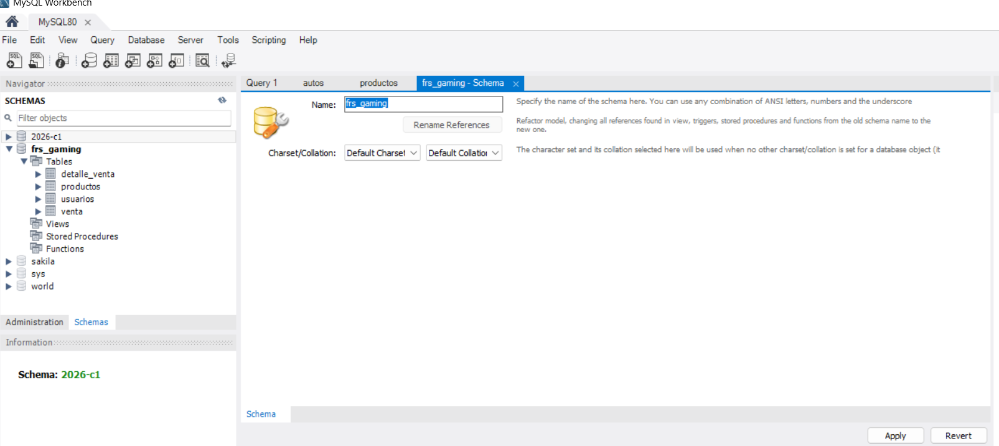
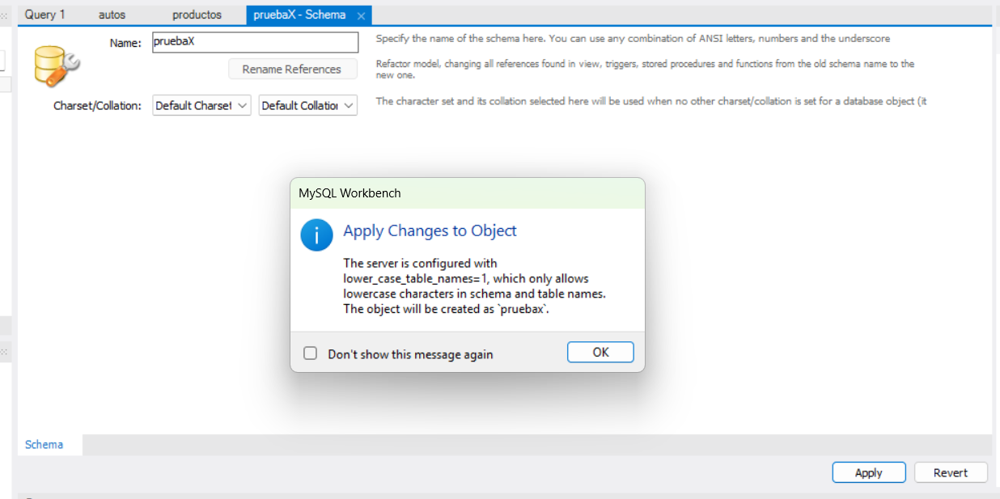
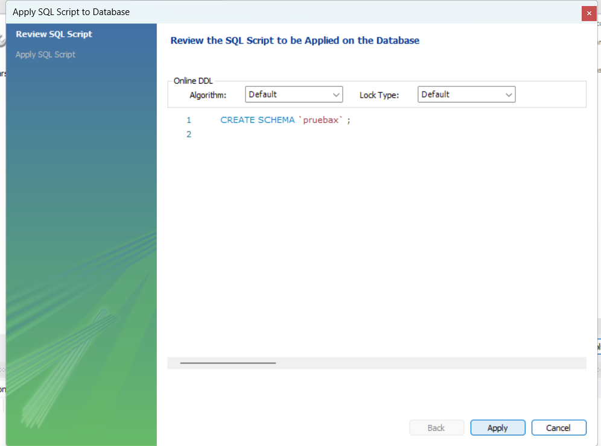

ESTRUCTURA PENSADA PARA LA BASE DE DATOS:
MAS abajo se ve como crear la tabla inicial para que funcione

1) PRODUCTOS:
    -id (pk int)
    -nombre (varchar)
    -descripcion detallada (varchar) opcional
    -categoria (enum de "consola" y "videojuego")
    -precio (float)
    -stock (int)
    -imagen(varchar -> url si es que usamos o si vamos a almacenar)

2) USUARIOS (no son los clientes, son los administradores): 
    -ID (int pk)
    -nombre (varchar)
    -apellido (varchar)
    -usuario (varchar unique)
    -email (varchar unique)
    -password (varchar) -> hashear
    -activo (boolean)

3) VENTAS: 
    -id (int pk)
    -nombre_cliente (string)
    -total (float)
    -fecha -> la base autogenera el created at (fecha)

4) DETALLE_VENTA:
    -id (int pk)
    -venta_id (int fk)
    -producto_id (int fk)
    -cantidad (int)
    -precio_unitario (float)
    -subtotal (float)

CREACION DE DB (PREVIO A EJECUTAR CODIGO)
1) Click derecho sobre los schemas o dbs creadas default saldran las siguientes opciones:

2) Seleccionar opcion "create schema" y en nombre escribir el nombre de la db: "frs_gaming". Luego click boton apply

3) Click en "ok"

4) Click en "apply"

5) Luego una vez creada se puede ejecutar en terminal el siguiente comando:

node server/app.js  

deberia crear las tablas en la db "frs_gaming"